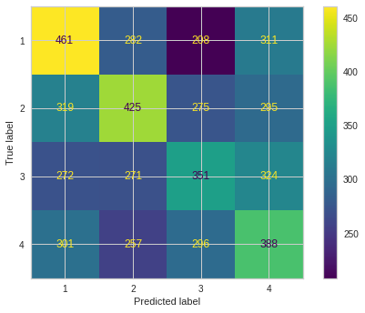

# Speech_Emotion_Recognition
Implementation of a model which classifies the voices from people of different genders and ages into 4 categories of angry, happy, sad, and neutral based on their emotions, by using different supervised and unsupervised machine learning models.

<h2> &nbsp;Supervised Learning</h2>

In supervised machine learning algorithms, a **labelled training** dataset is used first to train the underlying algorithm. This trained algorithm is then fed on the unlabeled test dataset to categorize them into similar groups.

There are several supervised learning methods. In this project we implemented the models of **SVM, Logistic Regression, KNN,** and **MLP (Neural Networks)**.

Here is a brief explanation of each of the methods named above:

<h4> &nbsp;1. Logistic Regression:</h4>

LR helps in finding the probability that a new instance belongs to a certain class. Since it is a probability, the outcome lies between 0 and 1. Therefore, to use the LR as a binary classifier, a threshold needs to be assigned to differentiate two classes.

<h4> &nbsp;2. Support Vector Machine (SVM):</h4>

Support vector machine (SVM) algorithm can classify both linear and non-linear data. It first maps each data item into an n-dimensional feature space where n is the number of features. It then identifies the hyperplane that separates the data items into two classes while maximizing the marginal distance for both classes and minimizing the classification errors.
To perform the classification, we then need to find the hyperplane that differentiates the two classes by the maximum margin.

<h4> &nbsp;3. K-Nearest Neighbor:</h4>

The K-nearest neighbor (KNN) algorithm is one of the simplest and earliest classification algorithms. The KNN algorithm does not require to consider probability values. The ‘K’ is the KNN algorithm is the number of nearest neighbors considered to take ‘vote’ from. The selection of different values for ‘K’ can generate different classification results for the same sample object.

<h4> &nbsp;4. MLP (Neural Networks):</h4>

Neural Networks are a set of machine learning algorithms which are inspired by the functioning of the neural networks of human brain. Likewise, NN algorithms can be represented as an interconnected group of nodes. The output of one node goes as input to another node for subsequent processing according to the interconnection. Nodes are normally grouped into a matrix called layer depending on the transformation they perform. Nodes and edges have weights that enable to adjust signal strengths of communication which can be amplified or weakened through repeated training. Based on the training and subsequent adaption of the matrices, node and edge weights, NNs can make a prediction for the test data.

<h4> &nbsp;Implementation of different supervised learning methods using scikit library functions in Google Colab: </h4>

In the previous parts of this project, we extracted some features from our initial dataset (voices from different genders, emotions and text IDs). Now with having different features from about 17000 samples, and labels for emotions and genders for each sample, by using the scikit library we implement each of the mentioned models above and measure the accuracy of each.

First, we defined dictionaries for 2 different genders: male, female, and 4 different emotions angry, happy, sad, and angry as below:

```ruby
Emotions = {
    1 : 'Angry',
    2 : 'Happy',
    3 : 'Sad',
    4 : 'Neutral'}

Emotions_2 = {
    'Angry' : 1,
    'Happy' : 2,
    'Sad' : 3,
    'Neutral' : 4
}

Gender = {
    'm' : 'male',
    'M' : 'male',
    'f' : 'female',
    'F' : 'female',
    'w' : 'female',
    'f ' : 'female'
}

Gender_2 = {
    'male' : 0,
    'female' : 1
}
```

Then, we used two speech feature extraction methods and combined the results to get our final set of features:

<h2> &nbsp;Feature Extraction</h2>

The first set of features were extracted using **MFCC** and **Chroma STFT** and combining the results of the 2 methods, giving us a total of 62 features (50 from MFCC and 12 from Chroma STFT).

MFCC(Mel-Frequency Cepstral Coefficients) is one of the most important methods to extract a feature of an audio signal and is used majorly whenever working on audio signals. The mel frequency cepstral coefficients (MFCCs) of a signal are a small set of features (usually about 10–20) which concisely describe the overall shape of a spectral envelope. Chroma_STFT performs short-time Fourier transform of an audio input and maps each STFT bin to chroma. In fact, it computes a chromagram from a waveform or power spectrogram.  STFT represents information about the classification of pitch and signal structure. It depicts the spike with high values in low values.

The second set of features were extracted using **librosa.feature.tempogram**. 

This feature is used when the music recording reveals significant tempo changes and the detection of locally periodic patterns becomes a challenging problem. In the concept of cyclic tempograms, the idea is to form tempo equivalence classes by identifying tempi that differ by a power of two. The resulting cyclic tempo features constitute a robust mid-level representation that reveals local tempo characteristics of music signals while being invariant to changes in the pulse level. Being
the tempo-based counterpart of the harmony-based chromagrams, cyclic tempograms are suitable for music analysis and retrieval tasks, where harmony-based criteria are not relevant. We extracted a total of 384 features in this case, and compared the results to the previous set before and after applying PCA as a method of dimension reduction on our data.

The corresponding code is as follows:

```ruby
def Extract_Data_First_Feature(data_path, voice_path):
    emotions = []
    features = []
    loaded_data = []
    Counter = 0
    datas = Read_CSV(data_path)
    datas['voice id'] = datas['voice id'].astype('str') + '.wav'
    os.chdir(voice_path)
    for file in os.listdir():           
      if file in datas['voice id'].values and file not in loaded_data:
          loaded_data.append(file)
          try:
            feature = Extract_Third_Feature(file)
            features.append(feature)
            index = datas[datas['voice id'] == os.path.basename(file)].index[0]
            emotion = Emotions[datas['emotionID'][index]]
            emotions.append(emotion)
          except Exception as e:
            print(e)
    return features, emotions
```

```ruby
def Extract_Data_Second_Feature(data_path, voice_path):
    emotions = []
    features = []
    loaded_data = []
    Counter = 0
    datas = Read_CSV(data_path)
    datas['voice id'] = datas['voice id'].astype('str') + '.wav'
    os.chdir(voice_path)
    for file in os.listdir():           
      if file in datas['voice id'].values and file not in loaded_data:
          loaded_data.append(file)
          try:
            feature = Extract_Third_Feature(file)
            features.append(feature)
            index = datas[datas['voice id'] == os.path.basename(file)].index[0]
            emotion = Emotions[datas['emotionID'][index]]
            emotions.append(emotion)
          except Exception as e:
            print(e)
    return features, emotions
```

We also implemented a shuffle algorithm to make our model more rebust:

```ruby
def Shuffle(data, labels)
```

<h4>Train-Test Split:</h4>

The train-test split procedure is used to estimate the performance of machine learning algorithms when they are used to make predictions on data not used to train the model. It is a fast and easy procedure to perform, the results of which allows us to compare the performance of machine learning algorithms for the predictive modeling problem.

In this project, after extracting the features and labels, first we split the data into test and train sets, and then implement the supervised learning methods on the split data as mentioned later in the report.

Finally, we put the features and emotions together, and split the data into train and test sets.

Here are the models for classifying the dataset based on **emotion** without applying dimension reduction to the data:

<h4>SVM:</h4>

```ruby
from sklearn.svm import SVC
kernel = ['linear', 'rbf', 'sigmoid']
gamma = ['scale', 'auto']
clf = make_pipeline(StandardScaler(), SVC(kernel, gamma))
```

<h4>KNN:</h4>

```ruby
clf = KNeighborsClassifier(weights='distance',metric='manhattan',algorithm='ball_tree',n_neighbors=i)
```

<h4>Logistic Regression:</h4>

```ruby
solver = ['saga', 'sag', 'liblinear', 'lbfgs', 'newton-cg']
max_iter = [250, 500, 100]
clf = LogisticRegression(penalty, solver, max_iter)
```

<h4>MLP:</h4>

```ruby
from sklearn.neural_network import MLPClassifier
hidden_layer_sizes = [100, 200, 300, 400, 500]
activation = ['relu', 'logistic', 'tanh']
solver = ['lbfgs', 'sgd', 'adam']
max_iter = [250, 500, 100]
clf = MLPClassifier(hidden_layer_sizes, activation, solver, max_iter)
```

Then, we find the best weights in each of the models with a **grid search algorithm**.

<h2>Evaluation metrics of the supervised learning algorithms:</h2>

<h4>1. ROC curve:</h4>

When we need to check or visualize the performance of the multi-class classification problem, we use the ROC (Receiver Operating Characteristics) curve. ROC is a probability curve and tells how much the model is capable of distinguishing between classes. The ROC curve is plotted with TPR against the FPR where TPR is on the y-axis and FPR is on the x-axis. A higher X-axis value indicates a higher number of False positives than True negatives. While a higher Y-axis value indicates a higher number of True positives than False negatives. So, the choice of the threshold depends on the ability to balance between False positives and False negatives.

<h4>2. Confusion matrix:</h4>
It is a performance measurement for machine learning classification problem where output can be two or more classes. It is a table with 4 different combinations of predicted and actual values.

It is extremely useful for measuring Recall, Precision, Specificity, Accuracy, and most importantly AUC-ROC curves.

**True Positive:** Interpretation: You predicted positive and it’s true.

**True Negative:** Interpretation: You predicted negative and it’s true.

**False Positive:** Interpretation: You predicted positive and it’s false.

**False Negative:** Interpretation: You predicted negative and it’s false.

In confusion matrices, we calculate some important values like accuracy, precision, and recall, which are explained below:

**Accuracy:** From all the classes (positive and negative), how many of them we have predicted correctly. Accuracy should be high as possible.

**Precision:** From all the classes we have predicted as positive, how many are actually positive. Precision should be high as possible.

**Recall:** From all the positive classes, how many we predicted correctly. Recall should be high as possible.

<h4>3. Learning curve:</h4>

A learning curve is a plot of model learning performance over experience or time. Learning curves are a widely used diagnostic tool in machine learning for algorithms that learn from a training dataset incrementally. Reviewing learning curves of models during training can be used to diagnose problems with learning, such as an underfit or overfit model, as well as whether the training and validation datasets are suitably representative.

Here are the **confusion matrices** for the best weights in each model:

<h4>SVM:</h4>


<h4>KNN:</h4>



<h4>Logistic Regression:</h4>


<h4>MLP:</h4>


We plot **ROC Curves** and **Learning Curves** for all 4 of the models. The results are almost the same, and look like this:

<h4>ROC:</h4>


<h4>Learning Curve:</h4>


<h2>Dimension Reduction:</h2>

The number of input variables or features for a dataset is referred to as its dimensionality. Dimensionality reduction refers to techniques that reduce the number of input variables in a dataset. More input features often make a predictive modeling task more challenging to model, more generally referred to as the curse of dimensionality. High-dimensionality statistics and dimensionality reduction techniques are often used for data visualization.

In this project, we used the PCA method for implementing the dimension reduction. The most common approach to dimensionality reduction is called principal components analysis or PCA. PCA helps us to identify patterns in data based on the correlation between features. It aims to find the directions of maximum variance in high-dimensional data and projects it onto a new subspace with equal or fewer dimensions than the original one. The orthogonal axes (principal components) of the new subspace can be interpreted as the directions of maximum variance given the constraint that the new feature axes are orthogonal to each other.

```ruby
from sklearn.decomposition import PCA
pca = PCA(n_components=0.95)
pca.fit(features)
reduced_features = pca.transform(features)
```

After applying PCA on our data, we got 14 features as a result. (from both datasets, with 62 and 384 features)

By comparing the accuracy of our models both before and after applying PCA to our dataset, we saw that in some cases it helped improve the model, but in some cases the results became worse.

ROC Curve after PCA:


Learning Curve after PCA:

 

Here are the methods for classifying the dataset based on **gender**:

applying the steps above for gender classification:

```ruby
svm_best = make_pipeline(StandardScaler(), SVC(kernel='rbf', gamma='auto'))
svm_best.fit(x_train, y_train)

knn_best = KNeighborsClassifier(weights='distance',metric='manhattan',algorithm='ball_tree',n_neighbors=3)
knn_best.fit(x_train, y_train)

lgr_best = LogisticRegression(penalty='l2', solver='newton-cg', max_iter=500)
lgr_best.fit(x_train, y_train)

mlp_best = MLPClassifier(hidden_layer_sizes=(300 ,), activation='logistic', solver='lbfgs', max_iter=250)
mlp_best.fit(x_train, y_train)
```

Here are the confusion matrices for the best weights in each model:

<h4>SVM:</h4>


<h4>KNN:</h4>


<h4>Logistic Regression:</h4>


<h4>MLP:</h4>


We plotted the ROC Curve for all 4 of the models. The results are almost the same. For instance, for the KNN model the results look like this:


We plotted the Learning Curve for all 4 of the models. The results are almost the same, and look like this:


Next, we applied PCA to the **gender classification** model. The ROC curve after dimension reduction:


The Learning curve after dimension reduction:


We did some more investigation regarding the **evaluation metrics**, which can be seen in the Jupyter notebook uploaded above.

<h2> &nbsp;Unsupervised Learning</h2>

**Unsupervised learning** is a machine learning technique in which models are not supervised using training dataset. Instead, models itself find the hidden patterns and insights from the given data. In fact, Unsupervised machine learning is the process of inferring underlying hidden patterns from historical data. Within such an approach, a machine learning model tries to find any similarities, differences, patterns, and structure in data by itself.

In this project we used different clustering methods. Clustering analysis is an unsupervised learning method that separates the data points into several specific bunches or groups, such that the data points in the same groups have similar properties and data points in different groups have different properties in some sense. There are several supervised learning methods, in this project we implemented the models of **DBSCAN** and **HDBSCAN**, **Kmeans**, and **GMM**.

Here is a brief explanation of each of the methods named above:

<h4> &nbsp;1. DBSCAN and HDBSCAN:</h4>

Density-Based Spatial Clustering of Applications with Noise (DBSCAN) is a base algorithm for density-based clustering. It can discover clusters of different shapes and sizes from a large amount of data, which is containing noise and outliers.

The DBSCAN algorithm uses two parameters:

**minPts:** The minimum number of points (a threshold) clustered together for a region to be considered dense.

**eps (ε):** A distance measure that will be used to locate the points in the neighborhood of any point.

<h4> &nbsp;2. Kmeans:</h4>

K-means is an algorithm for exclusive clustering, also known as partitioning or segmentation. It puts the data points into the predefined number of clusters known as K. Each data item then gets assigned to the nearest cluster center, called **centroids**.

<h4> &nbsp;3. GMM:</h4>

Gaussian Mixture Models (GMMs) is an algorithm used in probabilistic clustering. Since the mean or variance is unknown, the models assume that there is a certain number of Gaussian distributions, each representing a separate cluster. The algorithm is basically utilized to decide which cluster a particular data point belongs to.


<h4> &nbsp;Implementation of different unsupervised learning methods using scikit library functions in Google Colab: </h4>

By using the scikit library we implement each of the mentioned models above and measure the accuracy of each.

First, we import the needed libraries.

Here are the methods for classifying the dataset based on gender:

<h4>DBSCAN:</h4>

First, we find the best epsilon to put in the DBSCAN algorithm:

```ruby
nearest_neighbors = NearestNeighbors(n_neighbors=11)
neighbors = nearest_neighbors.fit(features)
distances, indices = neighbors.kneighbors(features)
distances = np.sort(distances[:,10], axis=0)
```

We see the results as below, so we put epsilon equal to 33 in the following code.


```ruby
dbscan = DBSCAN(eps = 33, min_samples = 124).fit(features) 
dbscan_labels = dbscan.labels_
```

We see the results as below:


So, the **DBSCAN** algorithm puts the data into 2 clusters.

We then implement a model with HDBSCAN algorithm. The difference between DBSCAN and HDBSCAN algorithms is that HDBSCAN is basically a DBSCAN implementation for varying epsilon values and therefore only needs the minimum cluster size as single input parameter. Unlike DBSCAN, this allows to it find clusters of variable densities without having to choose a suitable distance threshold first. However, there are cases where we could still benefit from the use of an epsilon threshold.

<h4>HDBSCAN:</h4>

Unlike DBSCAN, we can set the cluster size to the values we want.

The code and result for cluster size equal to 2:

```ruby
Hdbscan2 = hdbscan.HDBSCAN(min_cluster_size = 2, min_samples = 10).fit(features) 
hdbscan2_labels = Hdbscan2.labels_
```


For cluster size equal to 4:


For cluster size equal to 10:


As we see from the above plots, the clustering for 2 clusters has the best results. We will evaluate these models with different evaluation metrics later on this report.

<h4>Kmeans Algorithm:</h4>

The code and result for cluster size equal to 2:

```ruby
Kmeans2_model = KMeans(n_clusters= 2, random_state= 42)
Kmeans2_pred = Kmeans2_model.fit_predict(features)
```


For cluster size equal to 4:


For cluster size equal to 10:


As we see from the above plots, the clustering for 2 and 4 clusters have better results than the 10 clusters. We will evaluate these models with different evaluation metrics later on this report.

<h4>GMM algorithm:</h4>

The code and result for cluster size equal to 2:

```ruby
GMM2_model = GaussianMixture(n_components=2)
GMM2_pred = GMM2_model.fit_predict(features)
```


The code for cluster size equal to 4:


The code for cluster size equal to 10:


Now we need to evaluate all the models above.

When implementing a clustering algorithm for a dataset with no such target to aim for, an accuracy score is not possible. We therefore need to look for other types of measurement that give us an indication of performance. The most common is the distinctness of the clusters created.

Three important factors by which clustering can be evaluated are: **Clustering tendency**, **optimal number of clusters**, **clustering quality**. 

Clustering quality has both extrinsic and intrinsic measures.

**Extrinsic measures** are the measures which require ground truth labels. Examples are **Adjusted Rand index**, **Mutual-information based scores**, **Homogeneity**, **Completeness and V-measure**.

**Intrinsic measures** are the measures that don’t require ground truth labels. Some of these measures are **Silhouette Coefficient**, **Calinski-Harabasz index**, and **Davies-Bouldin index**.

We start from calculating the intrinsic measures.

<h4>Silhouette Coefficient</h4>

This score is between -1 and 1, where the higher the score, the more well defined and distinct the clusters are. The code corresponding to this metric(for dbscan for instance):

```ruby
metrics.silhouette_score(features,dbscan_labels)
```

The results:

```
silhouette score of dbscan: 0.28480473473081136
silhouette score of hdbscan 2: -0.036434168163789166
silhouette score of hdbscan 4: -0.034726678505026
silhouette score of hdbscan 10: 0.16306882711458648
silhouette score of kmeans 2: 0.2847176600287628
silhouette score of kmeans 4: 0.1896206009691554
silhouette score of kmeans 10: 0.10948630543611307
silhouette score of GMM 2: 0.09910263590870982
silhouette score of GMM 4: -0.006219543998652198
silhouette score of GMM 10: -0.07276504025055822
```

As we see, the highest Silhouette scores are for DBSCAN, Kmeans of 2 clusters and Kmeans of 4 clusters.
 
<h4>Calisnki-Harabasz score</h4>

Like the Silhouette Coefficient, the higher the score, the more well-defined the clusters are. This score has no bound, meaning that there is no acceptable or good value, and must be tracked throughout the development of the model. The code corresponding to this metric(for dbscan for instance):

```ruby
metrics.calinski_harabasz_score(features,dbscan_labels)
```

```
calinski harabasz score of dbscan: 2998.0390602501043
calinski harabasz score of hdbscan 2: 424.94116870181324
calinski harabasz score of hdbscan 4: 388.4098079172661
calinski harabasz score of hdbscan 10: 961.0191902267044
calinski harabasz score of kmeans 2: 9201.838922850844
calinski harabasz score of kmeans 4: 5886.817015205034
calinski harabasz score of kmeans 10: 3157.621357627711
calinski harabasz score of GMM 2: 2356.642133715847
calinski harabasz score of GMM 4: 899.3276383209715
calinski harabasz score of GMM 10: 477.028641364578
```

As we see, the highest Calisnki-Harabasz scores are for Kmeans of 2 clusters, Kmeans of 4 clusters, and Kmeans of 10 clusters.

<h4>Davies-Bouldin score</h4>

This score measures the similarity of the clusters, meaning that the lower the score the better the separation there is between the clusters. This score has no bound, meaning that there is no acceptable or good value, and must be tracked throughout the development of the model. The code corresponding to this metric(for dbscan for instance):

```ruby
metrics.davies_bouldin_score(features,dbscan_labels)
```

```
davies bouldin score of dbscan: 1.6336997476543926
davies bouldin score of hdbscan 2: 1.5231242358494455
davies bouldin score of hdbscan 4: 1.3769497878386594
davies bouldin score of hdbscan 10: 1.6806300722700183
davies bouldin score of kmeans 2: 1.2852571156938792
davies bouldin score of kmeans 4: 1.5740225167219135
davies bouldin score of kmeans 10: 1.8348467424439607
davies bouldin score of GMM 2: 2.4990362917528923
davies bouldin score of GMM 4: 6.659902754116131
davies bouldin score of GMM 10: 5.650554898248412
```

As we see the lowest Davies-Bouldin scores are for Kmeans of 2 clusters, HDBSCAN, and Kmeans of 4 clusters.
 
Now we continue by calculating the **extrinsic measures**.

<h4>adjusted rand index</h4>

The code corresponding to this metric(for dbscan for instance):

```ruby
metrics.adjusted_rand_score(genders,dbscan_labels)
```

```
rand index of dbscan: 0.01460115950154463
rand index of hdbscan 2: 0.02951996431899755
rand index of hdbscan 2: 0.050799873452305896
rand index of hdbscan 2: 0.02541355941770397
rand index of kmeans 2: 0.009089499243896296
rand index of kmeans 4: 0.02129346124346133
rand index of kmeans 10: 0.005656728145904376
rand index of GMM 2: 0.056964875164928964
rand index of GMM 4: 0.0072834213263010044
rand index of GMM 10: 0.0036994556474662524
```

As we see the highest rand indices are for GMM of 2 clusters, HDBSCAN, and Kmeans of 4 clusters.
 
<h4>Mutual Information</h4>

The code corresponding to this metric(for dbscan for instance):

```ruby
metrics.mutual_info_score(genders,dbscan_labels)
```

```
mutual information score of dbscan: 0.010980997390407782
mutual information score of hdbscan 2: 0.018745841763565255
mutual information score of hdbscan 4: 0.050799873452305896
mutual information score of hdbscan 10: 0.02541355941770397
mutual information score of kmeans 2: 0.00435183992582544
mutual information score of kmeans 4: 0.03346738199051055
mutual information score of kmeans 10: 0.03403679708649348
mutual information score of GMM 2: 0.028407201359370582
mutual information score of GMM 4: 0.011490972970172472
mutual information score of GMM 10: 0.02008988025118535
```

As we see, the highest mutual information scores are for Kmeans of 4 clusters, GMM of 2 clusters, and HDBSCAN.

<h4>Homogenity Score</h4>

The code corresponding to this metric(for dbscan for instance):

```ruby
metrics.homogeneity_score(genders,dbscan_labels)
```

```
homogenity score of dbscan: 0.0158561760263728
homogenity score of hdbscan 2: 0.027068339623253786
homogenity score of hdbscan 4: 0.04226229446864987
homogenity score of hdbscan 10: 0.023976978661123985
homogenity score of kmeans 2: 0.006283904589829145
homogenity score of kmeans 4: 0.02414170285445999
homogenity score of kmeans 10: 0.014748817101755225
homogenity score of GMM 2: 0.041019004845976904
homogenity score of GMM 4: 0.008289015705895178
homogenity score of GMM 10: 0.008705342299627715
```

As we see, the highest homogeneity scores are for GMM of 2 clusters, HDBSCAN and Kmeans of 2 clusters.

<h4>V-measure Score</h4>

The code corresponding to this metric(for dbscan for instance):

```ruby
metrics.v_measure_score(features,dbscan_labels)
```

```
v-measure score of dbscan: 0.0158561760263728
v-measure score of hdbscan 2: 0.027068339623253786
v-measure score of hdbscan 4: 0.04226229446864987
v-measure score of hdbscan 10: 0.023976978661123985
v-measure score of kmeans 2: 0.006283904589829145
v-measure score of kmeans 4: 0.02414170285445999
v-measure score of kmeans 10: 0.014748817101755225
v-measure score of GMM 2: 0.041019004845976904
v-measure score of GMM 4: 0.008289015705895178
v-measure score of GMM 10: 0.008705342299627715
```

As we see, the highest v-measure scores are for GMM of 2 clusters, HDBSCAN of 2 clusters, and Kmeans of 4 clusters.

From what we see from the scatter plots of the different models and different types of scores that we evaluated, the best results are for Kmeans algorithms in general, specifically Kmeans of number of clusters equal to 2 and 4. Other different clustering methods that put num of clusters equal to 2 have also good results, including DBSCAN and HDBSCAN, and GMM of 2 clusters.

We also take the 3 algorithms for number of clusters equal to 2, and perform dimension reduction on the data with PCA algorithm, and compare with the previous results:

```ruby
pca = PCA(n_components = 0.95)
pca.fit(features)
reduced_features = pca.transform(features)
```

<h4>DBSCAN:</h4>


```ruby
silhouette score of dbscan: 0.34714669659475655
calinski harabasz score of dbscan: 1511.5645001753876
davies bouldin score of dbscan: 1.4823861630682738
```

As we see, the Silhouette score is higher than before, but Calinski-Harabasz score and Davies-Bouldin scores are lower than before. Overall conclusion from the plot itself, is that without clustering the separation of classes was better.

<h4>KMEANS FOR 2 CLUSTERS:</h4>


```ruby
silhouette score of kmeans 2: 0.29936761998398076
calinski harabasz score of kmeans 2: 9972.451517431065
davies bouldin score of kmeans 2: 1.227230226316242
```

As we see, the Silhouette score and Calinski-Harabasz score are higher than before, and Davies Bouldin score is lower than before. Looking at the plots, both models with and without PCA are good clustering models, but the second one is a little better.

<h4>GMM FOR 2 CLUSTERS:</h4>


```ruby
silhouette score of GMM 2: 0.1388377597378705
calinski harabasz score of GMM 2: 3020.6025068001786
davies bouldin score of GMM 2: 2.1777109026744514
```

As we see, the Silhouette score and Calinski Harabasz score are higher than before, and Davies Bouldin score is lower than before. Looking at the plots, both models with and without PCA are good clustering models but the second one is a little better.

Now we repeat the steps above for the second set of features, which were developed as explained above. We have 384 features, by applying PCA we reduce the dimensions to 14.

The results are as below:

<h4>DBSCAN:</h4>


<h4>HDBSCAN FOR n=2:</h4>


<h4>HDBSCAN FOR n=4:</h4>


<h4>HDBSCAN FOR n=10:</h4>


As we see from the plots, the HDBSCAN has the best results for 2 clusters, and by increasing the number of clusters to 4 and 10, the model can not classify the data well, and only produces about 3 main clusters as seen in the plots.

<h4>Kmeans for n=2:</h4>


<h4>Kmeans for n=4:</h4>


<h4>Kmeans for n=10:</h4>


As we see from the plots the classifier works better than the one with previous features in Kmeans models. In all 3 models, the classifier has classified the data to the desired number of cluster well.

<h4>GMM for n=2:</h4>


<h4>GMM for n=4:</h4>


<h4>GMM for n=10:</h4>


As we see from the plots, the model acts almost good for n=2,4 but doesn’t produce the desired number of clusters when n=10.

Now we use the same evaluation metrics explained above the compare the results of our different models:

<h3>The Intrinsic Measures:</h3>

<h4>Silouhette Scores:</h4>

```
silhouette score of dbscan: 0.24809462888333075
silhouette score of hdbscan 2: 0.06221021575625356
silhouette score of hdbscan 4: -0.24070582274955551
silhouette score of hdbscan 10: -0.041688940069919606
silhouette score of kmeans 2: 0.40125791069604405
silhouette score of kmeans 4: 0.2546726609159781
silhouette score of kmeans 10: 0.1666509234059923
silhouette score of GMM 2: 0.2530010439150373
silhouette score of GMM 4: 0.038913229377365355
silhouette score of GMM 10: -0.0584968786912401
```

The highest Silouhette Scores are for kmeans of 2, kmeans of 4, and GMM of 2, with highest score of 0.4 which is higher than the results from previous features.

<h4>Calinski-Harabasz Scores:</h4>

```
calinski harabasz score of dbscan: 506.22646770134423
calinski harabasz score of hdbscan 2: 95.50745729940762
calinski harabasz score of hdbscan 4: 169.6274564202286
calinski harabasz score of hdbscan 10: 619.1605227317172
calinski harabasz score of kmeans 2: 14935.36689669014
calinski harabasz score of kmeans 4: 12039.959023890058
calinski harabasz score of kmeans 10: 7249.290878138621
calinski harabasz score of GMM 2: 7936.10808511462
calinski harabasz score of GMM 4: 3885.4652519578317
calinski harabasz score of GMM 10: 1852.0968794135556
```

The highest Calinski-Harabasz Scores are for kmeans of 2, kmeans of 4, and GMM of 2, with highest score of 14935 which is higher than the results from previous features.

<h4>David-Bouldin Scores:</h4>

```
davies bouldin score of dbscan: 5.026752775634968
davies bouldin score of hdbscan 2: 3.1198778623799113
davies bouldin score of hdbscan 4: 2.163204942329579
davies bouldin score of hdbscan 10: 2.930793266609374
davies bouldin score of kmeans 2: 0.9410759092395956
davies bouldin score of kmeans 4: 1.1683782190311085
davies bouldin score of kmeans 10: 1.4289886345000964
davies bouldin score of GMM 2: 1.3092177215329284
davies bouldin score of GMM 4: 2.117127532543442
davies bouldin score of GMM 10: 3.313212799235283
```

The lowest David-Bouldin Scores are for dbscan, kmeans of 2, and kmeans of 4, with lowest score of 0.026 which is lower than the results from previous features.

<h3>The Extrinsic Measures:</h3>

<h4>Adjusted Rand Indices:</h4>

```
rand index of dbscan: 4.265433675148219e-05
rand index of hdbscan 2: -0.0001646094791631494
rand index of hdbscan 4: 0.0045720711853102555
rand index of hdbscan 10: 0.005766064787364491
rand index of kmeans 2: 0.0025009058334804395
rand index of kmeans 4: 0.009991732055262341
rand index of kmeans 10: 0.02544958849468978
rand index of GMM 2: 0.004395630051311511
rand index of GMM 4: 0.009013527155037896
rand index of GMM 10: 0.06036364054380597
```

The highest Adjusted Rand Scores are for dbscan, Kmeans of 10, and Kmeans of 4, with highest score of 4.26 which is higher than the results from previous features.

<h4>Mutual Information Scores:</h4>

```
mutual information score of dbscan: 0.0012584796445544166
mutual information score of hdbscan 2: 0.001742693938171119
mutual information score of hdbscan 4: 0.0045720711853102555
mutual information score of hdbscan 10: 0.005766064787364491
mutual information score of kmeans 2: 0.0009033827559828955
mutual information score of kmeans 4: 0.017297041990934903
mutual information score of kmeans 10: 0.11151861717221759
mutual information score of GMM 2: 0.0018491823109499372
mutual information score of GMM 4: 0.01389310789852527
mutual information score of GMM 10: 0.23223063359894802
```

The highest Mutual Information Scores are for GMM of 10, kmeans of 10, and kmeans of 4, with highest score of 0.23 which is higher than the results from previous features.

<h4>Homogenity Scores: Scores:</h4>

```
homogenity score of dbscan: 0.0018172005747941334
homogenity score of hdbscan 2: 0.0025163890729882014
homogenity score of hdbscan 4: 0.003107895377083114
homogenity score of hdbscan 10: 0.0037946179327212792
homogenity score of kmeans 2: 0.0013044530918992089
homogenity score of kmeans 4: 0.012477224783362781
homogenity score of kmeans 10: 0.048323221598496856
homogenity score of GMM 2: 0.002670154557443912
homogenity score of GMM 4: 0.010021796228526314
homogenity score of GMM 10: 0.10063012485198787
```

The highest Homogenity Scores are for GMM of 10, Kmeans of 10, and Kmeans of 4, with highest score of 0.1 which is higher than the results from previous features.

<h4>V-measure Scores:</h4>

```
v-measure score of dbscan: 0.0018172005747941334
v-measure score of hdbscan 2: 0.0025163890729882014
v-measure score of hdbscan 4: 0.003107895377083114
v-measure score of hdbscan 10: 0.0037946179327212792
v-measure score of kmeans 2: 0.0013044530918992089
v-measure score of kmeans 4: 0.012477224783362781
v-measure score of kmeans 10: 0.048323221598496856
v-measure score of GMM 2: 0.002670154557443912
v-measure score of GMM 4: 0.010021796228526314
v-measure score of GMM 10: 0.10063012485198787
```

The highest V-measure Scores are for GMM of 10, Kmeans of 10, and Kmeans of 4, with highest score of 0.1 which is higher than the results from previous features.

So overall, we can conclude that the results are better with the second set of features in all the implemented models of different clustering methods.

